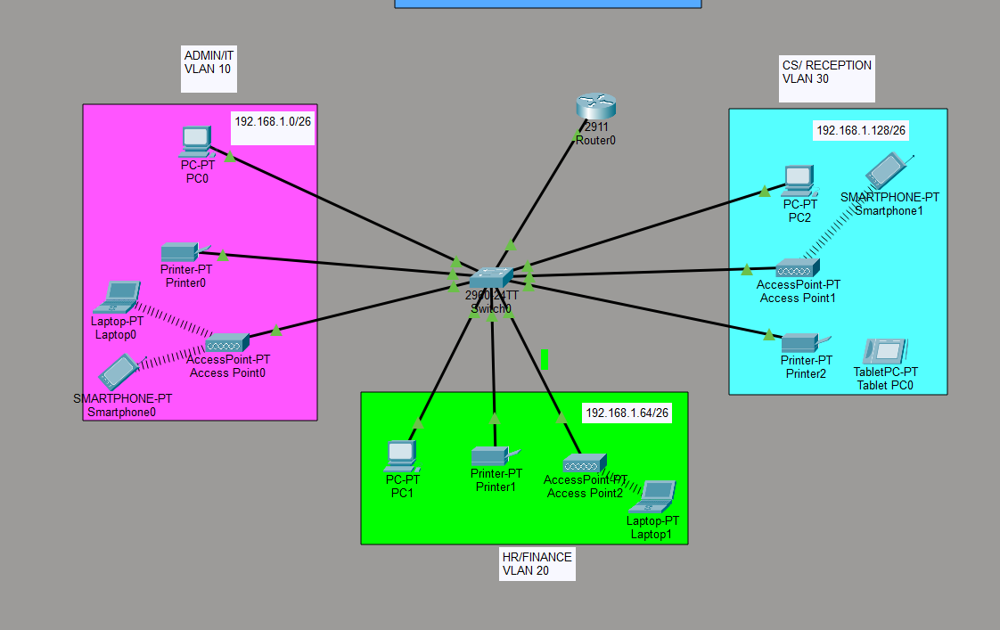

# Project: XYZ Company Branch Network Design

## Project Overview
This project involves designing and implementing a standalone local area network (LAN) for the new branch of XYZ Company, a fast-growing food trading enterprise. The network operates independently from the headquarters and is designed to support three distinct departments: **Admin/IT**, **Finance/HR**, and **Customer Service (CS)/Reception**. 

The architecture implements **VLAN segmentation**, **Inter-VLAN routing (Router-on-a-Stick)**, **dynamic IP allocation (DHCP)**, and **wireless connectivity** using minimal hardware (a single router and switch).

## Network Topology
The network follows a centralized Router-on-a-Stick (ROAS) topology to handle inter-VLAN routing efficiently.



### Hardware & Devices
- **Router:** 1x Cisco 2911 (Handles Inter-VLAN routing and acts as the DHCP Server).
- **Switch:** 1x Cisco 2960-24TT (Handles Layer 2 VLAN separation).
- **Wireless Infrastructure:** 3x Access Points (One dedicated to each department).
- **End Devices:** A mix of wired PCs, Network Printers, Laptops, Tablets, and Smartphones.

---

## IP Addressing & Subnetting Schema
The ISP provided a base Class C network of `192.168.1.0/24`. To accommodate 3 departments securely, the network was subnetted by borrowing 2 bits (2^2 = 4 subnets).

* **Base Network:** `192.168.1.0/24`
* **New Subnet Mask:** `/26` (`255.255.255.192`)
* **Block Size:** 64

### Departmental Allocation

| Department | VLAN ID | Network Address | Gateway (First Host) | Usable Host Range | Broadcast Address |
| :--- | :---: | :--- | :--- | :--- | :--- |
| **Admin/IT** | VLAN 10 | `192.168.1.0/26` | `192.168.1.1` | `.2` – `.62` | `192.168.1.63` |
| **Finance/HR** | VLAN 20 | `192.168.1.64/26` | `192.168.1.65` | `.66` – `.126` | `192.168.1.127` |
| **CS/Reception**| VLAN 30 | `192.168.1.128/26`| `192.168.1.129`| `.130` – `.190` | `192.168.1.191` |

---

## Configuration Logic

### 1. VLAN & Trunking Configuration (Switch)
The switch is configured to separate traffic logically into three VLANs. The link connecting the Switch to the Router is configured as a **Trunk Port** (802.1Q) to carry traffic for all VLANs.

### 2. Inter-VLAN Routing (Router-on-a-Stick)
To allow the separate VLANs to communicate with each other, sub-interfaces were created on the Cisco 2911 router.

```bash
# Sub-interface for Admin/IT (VLAN 10)
R1(config)# interface gigabitEthernet 0/0.10
R1(config-subif)# encapsulation dot1Q 10
R1(config-subif)# ip address 192.168.1.1 255.255.255.192

# Sub-interface for Finance/HR (VLAN 20)
R1(config)# interface gigabitEthernet 0/0.20
R1(config-subif)# encapsulation dot1Q 20
R1(config-subif)# ip address 192.168.1.65 255.255.255.192

# Sub-interface for CS/Reception (VLAN 30)
R1(config)# interface gigabitEthernet 0/0.30
R1(config-subif)# encapsulation dot1Q 30
R1(config-subif)# ip address 192.168.1.129 255.255.255.192
```

### 3. Dynamic Host Configuration Protocol (DHCP)
To meet the requirement of devices obtaining IPv4 addresses automatically, the Router is configured as a DHCP server with three separate pools corresponding to each VLAN.

```bash
# Exclude Default Gateway Addresses
R1(config)# ip dhcp excluded-address 192.168.1.1
R1(config)# ip dhcp excluded-address 192.168.1.65
R1(config)# ip dhcp excluded-address 192.168.1.129

# DHCP Pool for Admin/IT (VLAN 10)
R1(config)# ip dhcp pool Admin-Pool
R1(dhcp-config)# network 192.168.1.0 255.255.255.192
R1(dhcp-config)# default-router 192.168.1.1
R1(dhcp-config)# dns-server 192.168.1.1
R1(dhcp-config)# domain-name Admin.com
R1(dhcp-config)# exit

# DHCP Pool for Finance/HR (VLAN 20)
R1(config)# ip dhcp pool Finance-Pool
R1(dhcp-config)# network 192.168.1.64 255.255.255.192
R1(dhcp-config)# default-router 192.168.1.65
R1(dhcp-config)# dns-server 192.168.1.65
R1(dhcp-config)# domain-name Finance.com
R1(dhcp-config)# exit

# DHCP Pool for CS/Reception (VLAN 30)
R1(config)# ip dhcp pool CS-Pool
R1(dhcp-config)# network 192.168.1.128 255.255.255.192
R1(dhcp-config)# default-router 192.168.1.129
R1(dhcp-config)# dns-server 192.168.1.129
R1(dhcp-config)# domain-name CS.com
R1(dhcp-config)# exit
```

### 4. Wireless Integration
Access points are connected to switch ports assigned to specific VLANs. Wireless devices (Laptops, Smartphones, Tablets) associate with their respective departmental APs and automatically receive their IP configuration via the Router's DHCP pools.

---

## Testing & Verification
* **DHCP Verification:** End devices successfully obtain an IP address, Subnet Mask, and Default Gateway automatically upon connecting to the network (wired or wireless).
* **Inter-VLAN Connectivity:** Successful ICMP ping tests between devices across different departments (e.g., PC0 in Admin/IT successfully pings Tablet PC0 in CS/Reception), verifying that the Router-on-a-Stick configuration is properly routing packets between VLANs.
