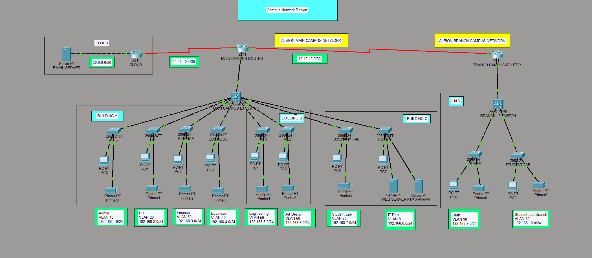

# Project 4: Albion University Campus Network Design

## Project Overview
This project involves the planning, design, and implementation of a scalable enterprise network for **Albion University**. The infrastructure spans two geographically separated sites (situated 20 miles apart): a Main Campus and a smaller Branch Campus. The design emphasizes logical segmentation using VLANs for four distinct faculties, dynamic IP allocation, Inter-VLAN routing (Router-on-a-Stick), and dynamic routing using RIPv2 to ensure full end-to-end connectivity, including access to an externally hosted Cloud Email Server.

## Network Topology
The topology utilizes a wide-area network (WAN) link to connect the Main Campus and the Branch Campus, alongside a dedicated link to the Cloud network for external services.



### Hardware Architecture
* **Core Routers:** 2x Cisco 2911 (`RT-Main` and `RT-Branch`) connected via Serial DCE cables. An additional router simulates the ISP/Cloud connection.
* **Core/Distribution Switches:** Cisco 3650-24PS Multilayer Switches serving as the distribution layer for both campuses.
* **Access Switches:** Cisco 2960-24TT switches deployed across buildings to provide end-device connectivity.
* **End Devices:** Staff PCs, Student Lab PCs, Network Printers, Internal Servers (Web & FTP), and an External Cloud Email Server.

---

## IP Addressing & VLAN Schema

### WAN Links (Serial Connections)
| Link | Network Address | Subnet Mask | Routing Protocol |
| :--- | :--- | :--- | :--- |
| **RT-Main ↔ RT-Branch** | `10.10.10.0/30` | `255.255.255.252` | RIPv2 |
| **RT-Main ↔ Cloud Router** | `10.10.10.4/30` | `255.255.255.252` | Static Routing |

### Main Campus Deployment (RT-Main)
| Building | Department / Faculty | VLAN ID | Network Address | Subnet Mask |
| :--- | :--- | :---: | :--- | :--- |
| **Building A** | Admin | VLAN 10 | `192.168.1.0/24` | `255.255.255.0` |
| **Building A** | HR | VLAN 20 | `192.168.2.0/24` | `255.255.255.0` |
| **Building A** | Finance | VLAN 30 | `192.168.3.0/24` | `255.255.255.0` |
| **Building A** | Business | VLAN 40 | `192.168.4.0/24` | `255.255.255.0` |
| **Building B** | Engineering & Computing | VLAN 50 | `192.168.5.0/24` | `255.255.255.0` |
| **Building B** | Art & Design | VLAN 60 | `192.168.6.0/24` | `255.255.255.0` |
| **Building C** | Student Lab | VLAN 70 | `192.168.7.0/24` | `255.255.255.0` |
| **Building C** | IT Department (Servers) | VLAN 80 | `192.168.8.0/24` | `255.255.255.0` |

### Branch Campus Deployment (RT-Branch)
| Faculty | Department | VLAN ID | Network Address | Subnet Mask |
| :--- | :--- | :---: | :--- | :--- |
| **Health & Sciences** | Staff | VLAN 90 | `192.168.9.0/24` | `255.255.255.0` |
| **Health & Sciences** | Student Lab Branch | VLAN 100 | `192.168.10.0/24` | `255.255.255.0` |

---

## Configuration Guide

### 1. Main Campus Router (`RT-Main`)

#### Setting up DHCP Exclusions and Pools
```bash
RT-Main(config)# ip dhcp excluded-address 192.168.1.1
RT-Main(config)# ip dhcp excluded-address 192.168.2.1
RT-Main(config)# ip dhcp excluded-address 192.168.3.1
# ... (exclude gateway ip address) 

RT-Main(config)# ip dhcp pool Admin-pool
RT-Main(dhcp-config)# network 192.168.1.0 255.255.255.0
RT-Main(dhcp-config)# default-router 192.168.1.1
RT-Main(dhcp-config)# dns-server 192.168.1.1
RT-Main(dhcp-config)# exit

RT-Main(config)# ip dhcp pool HR-pool
RT-Main(dhcp-config)# network 192.168.2.0 255.255.255.0
RT-Main(dhcp-config)# default-router 192.168.2.1
RT-Main(dhcp-config)# dns-server 192.168.2.1
RT-Main(dhcp-config)# exit

RT-Main(config)# ip dhcp pool Finance-pool
RT-Main(dhcp-config)# network 192.168.3.0 255.255.255.0
RT-Main(dhcp-config)# default-router 192.168.3.1
RT-Main(dhcp-config)# dns-server 192.168.3.1
RT-Main(dhcp-config)# exit

RT-Main(config)# ip dhcp pool Business-pool
RT-Main(dhcp-config)# network 192.168.4.0 255.255.255.0
RT-Main(dhcp-config)# default-router 192.168.4.1
RT-Main(dhcp-config)# dns-server 192.168.4.1
RT-Main(dhcp-config)# exit

RT-Main(config)# ip dhcp pool E&C-pool
RT-Main(dhcp-config)# network 192.168.5.0 255.255.255.0
RT-Main(dhcp-config)# default-router 192.168.5.1
RT-Main(dhcp-config)# dns-server 192.168.5.1
RT-Main(dhcp-config)# exit

RT-Main(config)# ip dhcp pool A&D-pool
RT-Main(dhcp-config)# network 192.168.6.0 255.255.255.0
RT-Main(dhcp-config)# default-router 192.168.6.1
RT-Main(dhcp-config)# dns-server 192.168.6.1
RT-Main(dhcp-config)# exit

RT-Main(config)# ip dhcp pool StudentLab-pool
RT-Main(dhcp-config)# network 192.168.7.0 255.255.255.0
RT-Main(dhcp-config)# default-router 192.168.7.1
RT-Main(dhcp-config)# dns-server 192.168.7.1
RT-Main(dhcp-config)# exit

RT-Main(config)# ip dhcp pool IT-pool
RT-Main(dhcp-config)# network 192.168.8.0 255.255.255.0
RT-Main(dhcp-config)# default-router 192.168.8.1
RT-Main(dhcp-config)# dns-server 192.168.8.1
RT-Main(dhcp-config)# exit
```

#### Configuring Inter-VLAN Routing (Sub-Interfaces)
```bash
RT-Main(config)# interface GigabitEthernet0/0
RT-Main(config-if)# no shutdown
RT-Main(config-if)# exit

RT-Main(config)# interface GigabitEthernet0/0.10
RT-Main(config-subif)# encapsulation dot1Q 10
RT-Main(config-subif)# ip address 192.168.1.1 255.255.255.0
RT-Main(config-subif)# exit

RT-Main(config)# interface GigabitEthernet0/0.20
RT-Main(config-subif)# encapsulation dot1Q 20
RT-Main(config-subif)# ip address 192.168.2.1 255.255.255.0
RT-Main(config-subif)# exit

RT-Main(config)# interface GigabitEthernet0/0.30
RT-Main(config-subif)# encapsulation dot1Q 30
RT-Main(config-subif)# ip address 192.168.3.1 255.255.255.0
RT-Main(config-subif)# exit

RT-Main(config)# interface GigabitEthernet0/0.40
RT-Main(config-subif)# encapsulation dot1Q 40
RT-Main(config-subif)# ip address 192.168.4.1 255.255.255.0
RT-Main(config-subif)# exit

RT-Main(config)# interface GigabitEthernet0/0.50
RT-Main(config-subif)# encapsulation dot1Q 50
RT-Main(config-subif)# ip address 192.168.5.1 255.255.255.0
RT-Main(config-subif)# exit

RT-Main(config)# interface GigabitEthernet0/0.60
RT-Main(config-subif)# encapsulation dot1Q 60
RT-Main(config-subif)# ip address 192.168.6.1 255.255.255.0
RT-Main(config-subif)# exit

RT-Main(config)# interface GigabitEthernet0/0.70
RT-Main(config-subif)# encapsulation dot1Q 70
RT-Main(config-subif)# ip address 192.168.7.1 255.255.255.0
RT-Main(config-subif)# exit

RT-Main(config)# interface GigabitEthernet0/0.80
RT-Main(config-subif)# encapsulation dot1Q 80
RT-Main(config-subif)# ip address 192.168.8.1 255.255.255.0
RT-Main(config-subif)# exit
```

#### Configuring WAN Links & Dynamic Routing (RIPv2)
```bash
RT-Main(config)# interface Serial0/1/0
RT-Main(config-if)# ip address 10.10.10.5 255.255.255.252
RT-Main(config-if)# clock rate 64000
RT-Main(config-if)# no shutdown
RT-Main(config-if)# exit

RT-Main(config)# interface Serial0/1/1
RT-Main(config-if)# ip address 10.10.10.1 255.255.255.252
RT-Main(config-if)# clock rate 64000
RT-Main(config-if)# no shutdown
RT-Main(config-if)# exit

RT-Main(config)# router rip
RT-Main(config-router)# version 2
RT-Main(config-router)# network 10.0.0.0
RT-Main(config-router)# network 192.168.1.0
RT-Main(config-router)# network 192.168.2.0
RT-Main(config-router)# network 192.168.3.0
RT-Main(config-router)# network 192.168.4.0
RT-Main(config-router)# network 192.168.5.0
RT-Main(config-router)# network 192.168.6.0
RT-Main(config-router)# network 192.168.7.0
RT-Main(config-router)# network 192.168.8.0
RT-Main(config-router)# no auto-summary
RT-Main(config-router)# exit
```

---

### 2. Branch Campus Router (`RT-Branch`)

#### Setting up DHCP Exclusions and Pools
```bash
RT-Branch(config)# ip dhcp excluded-address 192.168.9.1
RT-Branch(config)# ip dhcp excluded-address 192.168.10.1

RT-Branch(config)# ip dhcp pool Staff-pool
RT-Branch(dhcp-config)# network 192.168.9.0 255.255.255.0
RT-Branch(dhcp-config)# default-router 192.168.9.1
RT-Branch(dhcp-config)# dns-server 192.168.9.1
RT-Branch(dhcp-config)# exit

RT-Branch(config)# ip dhcp pool Studlb-pool
RT-Branch(dhcp-config)# network 192.168.10.0 255.255.255.0
RT-Branch(dhcp-config)# default-router 192.168.10.1
RT-Branch(dhcp-config)# dns-server 192.168.10.1
RT-Branch(dhcp-config)# exit
```

#### Configuring Inter-VLAN Routing (Sub-Interfaces)
```bash
RT-Branch(config)# interface GigabitEthernet0/0
RT-Branch(config-if)# no shutdown
RT-Branch(config-if)# exit

RT-Branch(config)# interface GigabitEthernet0/0.90
RT-Branch(config-subif)# encapsulation dot1Q 90
RT-Branch(config-subif)# ip address 192.168.9.1 255.255.255.0
RT-Branch(config-subif)# exit

RT-Branch(config)# interface GigabitEthernet0/0.100
RT-Branch(config-subif)# encapsulation dot1Q 100
RT-Branch(config-subif)# ip address 192.168.10.1 255.255.255.0
RT-Branch(config-subif)# exit
```

#### Configuring WAN Links & Dynamic Routing (RIPv2)
```bash
RT-Branch(config)# interface Serial0/1/0
RT-Branch(config-if)# ip address 10.10.10.2 255.255.255.252
RT-Branch(config-if)# no shutdown
RT-Branch(config-if)# exit

RT-Branch(config)# router rip
RT-Branch(config-router)# version 2
RT-Branch(config-router)# network 10.0.0.0
RT-Branch(config-router)# network 192.168.9.0
RT-Branch(config-router)# network 192.168.10.0
RT-Branch(config-router)# no auto-summary
RT-Branch(config-router)# exit
```

---

### 3. Core/Distribution Switch (`SW-Main`)
*Connecting the Router to the Building Access Switches using Trunking.*

```bash
SW-Main(config)# interface GigabitEthernet1/0/1
SW-Main(config-if)# switchport mode trunk
SW-Main(config-if)# exit

SW-Main(config)# interface GigabitEthernet1/0/2
SW-Main(config-if)# switchport mode trunk
SW-Main(config-if)# exit

SW-Main(config)# interface GigabitEthernet1/0/3
SW-Main(config-if)# switchport mode trunk
SW-Main(config-if)# exit

SW-Main(config)# interface GigabitEthernet1/0/4
SW-Main(config-if)# switchport mode trunk
SW-Main(config-if)# exit
```

---

### 4. Branch Access Switch (`SW-Branch`)
*Connecting the Router, Staff PCs, and Student Labs to their respective VLANs.*

```bash
SW-Branch(config)# interface GigabitEthernet1/0/1
SW-Branch(config-if)# switchport mode trunk
SW-Branch(config-if)# exit

SW-Branch(config)# interface GigabitEthernet1/0/2
SW-Branch(config-if)# switchport mode access
SW-Branch(config-if)# switchport access vlan 90
SW-Branch(config-if)# exit

SW-Branch(config)# interface GigabitEthernet1/0/3
SW-Branch(config-if)# switchport mode access
SW-Branch(config-if)# switchport access vlan 100
SW-Branch(config-if)# exit
```

---

## Testing & Verification
1. **DHCP Validation:** All host PCs in Main Campus (Buildings A, B, and C) and Branch Campus dynamically acquire valid IP addresses from their respective pools with correct gateways.
2. **Inter-Campus Connectivity:** Successful cross-site ICMP Echo (Ping) tracking from Building A (e.g., Admin PC `192.168.1.X`) to Branch Campus (e.g., Staff PC `192.168.9.X`) via RIPv2 routing.
3. **Internal Server Access:** All student and staff end devices can successfully interact with the University Web Server and internal data archives located inside the IT Department (VLAN 80).
4. **Cloud Mail Server Verification:** External static routing boundaries validated through successful email communication to the external cloud infrastructure network.