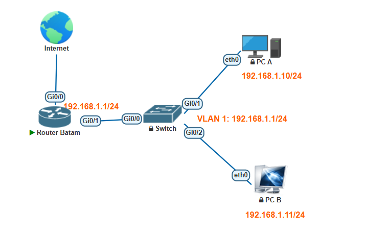

# Project 10: Basic Router and Switch Configuration

## Project Overview
This project covers the foundational setup and configuration of a Cisco Router and Switch, alongside endpoint PC IP address assignment. The lab demonstrates essential security practices (passwords, banners, encryption), remote access setup (VTY), interface descriptions, DHCP client configuration, and fundamental connectivity testing.

## Network Topology
The lab consists of a Router acting as a gateway, a Switch for local distribution, and two end-user PCs.



* **Router:** Batam
* **Switch:** Switch9200
* **PCs:** PC A, PC B

---

## Lab Tasks & Configuration Logic

### Part 1: Router Configuration (Batam)

**1) Basic Device Setup and Security**
Configure the hostname, disable DNS lookups to prevent CLI freezing on typos, and set an authorized access banner.
```bash
Router> enable
Router# configure terminal
Router(config)# hostname Batam
Batam(config)# no ip domain-lookup
Batam(config)# banner login #This is the Batam Router. Authorized Access Only #
```

**2) Securing the Device Interfaces**
Secure the privileged EXEC mode, encrypt plaintext passwords, and secure Console, VTY (SSH/Telnet), and AUX lines.
```bash
Batam(config)# enable secret cisco
Batam(config)# service password-encryption

# Securing Console
Batam(config)# line console 0
Batam(config-line)# logging synchronous
Batam(config-line)# password class
Batam(config-line)# login

# Securing VTY (Remote Access)
Batam(config-line)# line vty 0 4
Batam(config-line)# password class
Batam(config-line)# login

# Securing AUX
Batam(config-line)# line aux 0
Batam(config-line)# password class
Batam(config-line)# login
Batam(config-line)# exit

# Optional: Disable further encryption for new passwords
Batam(config)# no service password-encryption
```

**3) Interface Configuration**
Configure the internal LAN interface and the external Internet-facing interface (using DHCP).
```bash
# LAN Interface
Batam(config)# interface gigabitethernet 0/1
Batam(config-if)# description Link to LAN
Batam(config-if)# ip address 192.168.1.1 255.255.255.0
Batam(config-if)# no shutdown

# Internet Interface
Batam(config-if)# interface gigabitethernet 0/0
Batam(config-if)# description Link to Internet
Batam(config-if)# ip address dhcp
Batam(config-if)# no shutdown
Batam(config-if)# exit
Batam(config)# exit

# Save Configuration
Batam# copy running-config startup-config
```

---

### Part 2: Switch Configuration (Switch9200)

**1) Basic Setup and Security**
Configure the hostname, disable DNS lookups, and secure the device.
```bash
switch> enable
switch# configure terminal
switch(config)# no ip domain-lookup
switch(config)# hostname Switch9200
Switch9200(config)# enable secret cisco
```

**2) Securing Access Lines**
Secure the console and VTY lines. Notice the `exec-timeout 0 0` which prevents the console session from automatically logging out.
```bash
# Securing Console
Switch9200(config)# line console 0
Switch9200(config-line)# logging synchronous
Switch9200(config-line)# password switch
Switch9200(config-line)# login
Switch9200(config-line)# exec-timeout 0 0
Switch9200(config-line)# exit

# Securing VTY
Switch9200(config)# line vty 0 98
Switch9200(config-line)# password class
Switch9200(config-line)# login
Switch9200(config-line)# exit
```

**3) Management IP and Interfaces**
Set the default gateway, assign an IP to the management VLAN, and add descriptive labels to the physical ports.
```bash
# Gateway and Management VLAN
Switch9200(config)# ip default-gateway 192.168.1.1
Switch9200(config)# interface vlan 1
Switch9200(config-if)# ip address 192.168.1.2 255.255.255.0
Switch9200(config-if)# no shutdown

# Interface Descriptions
Switch9200(config-if)# interface gigabitethernet 0/0
Switch9200(config-if)# description Link to Router

Switch9200(config-if)# interface gigabitethernet 0/1
Switch9200(config-if)# description Link to PC A

Switch9200(config-if)# interface gigabitethernet 0/2
Switch9200(config-if)# description Link to PC B
Switch9200(config-if)# exit
Switch9200(config)# exit

# Save Configuration
Switch9200# copy running-config startup-config
```

---

### Part 3: PC Configuration (VPCS)

**1) Configure PC A**
Assign the IP address, subnet mask, default gateway, and DNS server. Verify and test connectivity.
```bash
# Assign IP and Gateway
PC-A> ip 192.168.1.10/24 192.168.1.1

# Assign DNS
PC-A> ip dns 8.8.8.8

# Verify Configuration
PC-A> show ip

# Test Connectivity to Gateway
PC-A> ping 192.168.1.1
```

**2) Configure PC B**
Assign the IP address, subnet mask, default gateway, and DNS server. Verify and test connectivity.
```bash
# Assign IP and Gateway
PC-B> ip 192.168.1.11/24 192.168.1.1

# Assign DNS
PC-B> ip dns 8.8.8.8

# Verify Configuration
PC-B> show ip

# Test Connectivity to Gateway
PC-B> ping 192.168.1.1
```

---