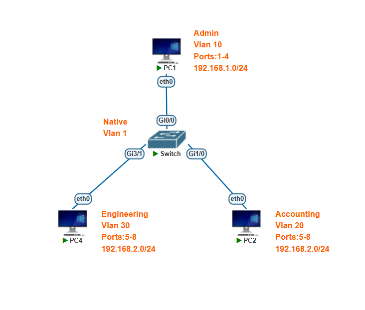

# Project 2: Switch VLAN Configuration

## Project Overview
This project focuses on configuring Virtual Local Area Networks (VLANs) on a Cisco Catalyst 9200 Switch. The implementation aims to divide the broadcast domain into logical segments (Admin, Accounting, and Engineering) to improve security and local network traffic management. Additionally, this lab demonstrates bulk configuration using the `interface range` command.

## Network Topology
The lab utilizes a Cisco Catalyst 9200 switch connecting multiple access ports to different VLAN groups.



### VLAN & Port Assignment Schema
| VLAN ID | VLAN Name | Interface Range | Mode | Group Description |
| :--- | :--- | :--- | :--- | :--- |
| **VLAN 10** | Admin | `GigabitEthernet 0/0 - 3` | Access | Management / Administrator network |
| **VLAN 20** | Accounting | `GigabitEthernet 1/0 - 3` | Access | Finance / Accounting network |
| **VLAN 30** | Engineering | `GigabitEthernet 2/0 - 3` | Access | Technical / Engineering network |

---

## Lab Tasks & Configuration Logic

### Part 1: Initial Setup & Hostname

**1) Enter Privileged EXEC Mode and Global Configuration Mode.**
```bash
Switch> enable
Switch# configure terminal
```

**2) Change the device hostname to 'Switch9200'.**
```bash
Switch(config)# hostname Switch9200
```

---

### Part 2: VLAN Creation and Naming

**3) Create VLAN 10 and name it 'Admin'.**
```bash
Switch9200(config)# vlan 10
Switch9200(config-vlan)# name Admin
Switch9200(config-vlan)# exit
```

**4) Create VLAN 20 and name it 'Accounting'.**
```bash
Switch9200(config)# vlan 20
Switch9200(config-vlan)# name Accounting
```

**5) Create VLAN 30 directly from VLAN configuration mode and name it 'Engineering'.**
```bash
Switch9200(config-vlan)# vlan 30
Switch9200(config-vlan)# name Engineering
Switch9200(config-vlan)# exit
```

---

### Part 3: Port Allocation to VLANs (Access Mode)

**6) Assign ports GigabitEthernet 0/0 to 0/3 to VLAN 10 (Admin).**
```bash
Switch9200(config)# interface range gigabitethernet 0/0 - 3
Switch9200(config-if-range)# switchport mode access
Switch9200(config-if-range)# switchport access vlan 10
```

**7) Assign ports GigabitEthernet 1/0 to 1/3 to VLAN 20 (Accounting).**
```bash
Switch9200(config-if-range)# interface range gigabitethernet 1/0 - 3
Switch9200(config-if-range)# switchport mode access
Switch9200(config-if-range)# switchport access vlan 20
```

**8) Assign ports GigabitEthernet 2/0 to 2/3 to VLAN 30 (Engineering).**
```bash
Switch9200(config-if-range)# interface range gigabitethernet 2/0 - 3
Switch9200(config-if-range)# switchport mode access
Switch9200(config-if-range)# switchport access vlan 30
Switch9200(config-if-range)# exit
```

---

### Part 4: Save Configuration

**9) Exit Global Configuration Mode and save the running configuration to NVRAM.**
```bash
Switch9200(config)# exit
Switch9200# copy running-config startup-config
Destination filename [startup-config]? 
Building configuration...
[OK]
Switch9200#
```

---